ch04-Object-Relational SQL(Oracle)
---

<!-- TOC -->

- [1. 对象类型(Object Type)](#1-对象类型object-type)
  - [1.1. 对象类型的创建与删除](#11-对象类型的创建与删除)
  - [1.2. 对象类型的使用](#12-对象类型的使用)
  - [1.3. 对象值的创建、查询与更新](#13-对象值的创建查询与更新)
    - [1.3.1. 对象值的创建](#131-对象值的创建)
    - [1.3.2. 对象的查询](#132-对象的查询)
    - [1.3.3. 对象值的更新](#133-对象值的更新)
  - [1.4. 对象的引用类型(`REF <object type>`)](#14-对象的引用类型ref-object-type)
    - [1.4.1. 对象类型之间的引用关系](#141-对象类型之间的引用关系)
    - [1.4.2. 创建含有引用类型的关系表](#142-创建含有引用类型的关系表)
    - [1.4.3. 引用关系查询](#143-引用关系查询)
    - [1.4.4. 函数与谓词](#144-函数与谓词)
    - [1.4.5. 类型的循环嵌套定义](#145-类型的循环嵌套定义)
    - [1.4.6. 其他约束](#146-其他约束)
      - [1.4.6.1. 两张表之间的相互REF关系的定义](#1461-两张表之间的相互ref关系的定义)
      - [1.4.6.2. 两个具有相互REF关系的表/类型的删除](#1462-两个具有相互ref关系的表类型的删除)
      - [1.4.6.3. REF属性数据的加载](#1463-ref属性数据的加载)
- [2. 集合类型(Collection Type)](#2-集合类型collection-type)
  - [2.1. Table Types and Nested Tables(嵌套表)](#21-table-types-and-nested-tables嵌套表)
    - [2.1.1. Oracle数据库注意](#211-oracle数据库注意)
    - [2.1.2. Nested Cursors(嵌套游标)](#212-nested-cursors嵌套游标)
  - [2.2. Array Types 数组类型](#22-array-types-数组类型)
- [3. PL/SQL Procedures, UDFs, and Methods](#3-plsql-procedures-udfs-and-methods)
- [4. Extern Functions and Packaged User-Defined Types(UDTs)](#4-extern-functions-and-packaged-user-defined-typesudts)

<!-- /TOC -->

# 1. 对象类型(Object Type)

## 1.1. 对象类型的创建与删除
1. 创建:`CREATE TYPE typename AS OBJECT (attrname  datatype, ......);`
2. 删除:`DROP TYPE typename;`
3. 数据类型一经定义，便以持久形式保存在数据库系统中，用户可以像使用系统内置的数据类型一样使用这些复杂的数据类型来扩充系统的数据类型。

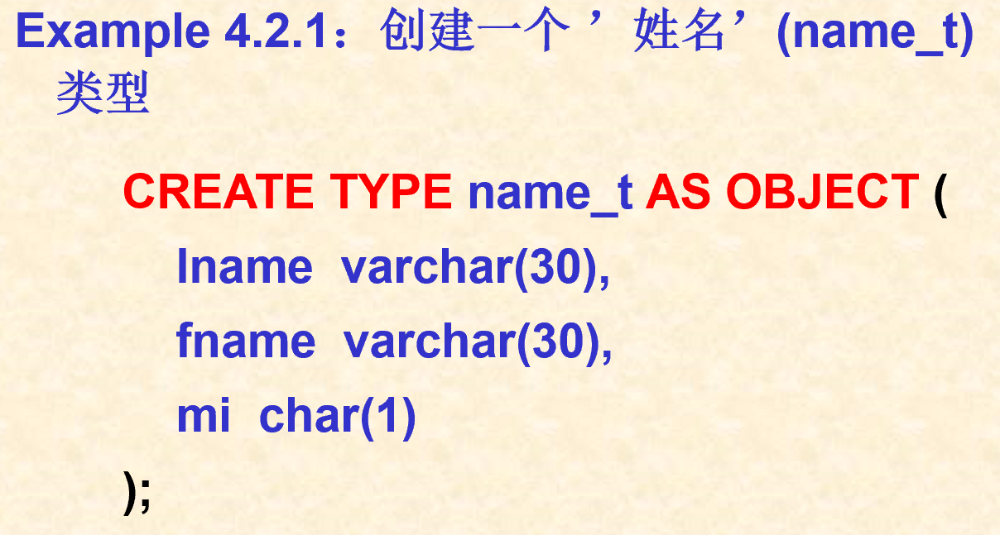

4. 先创建对象类型，然后创建表。

## 1.2. 对象类型的使用
1. 使用所创建的对象类型来创建新类型
  
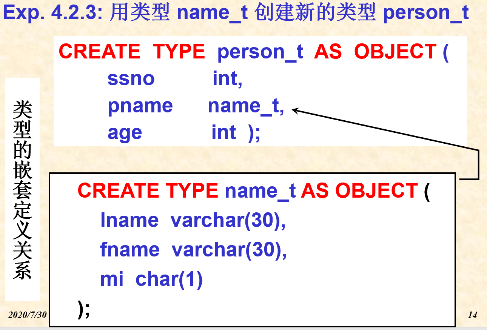

2. 使用所创建的对象类型来创建新的表

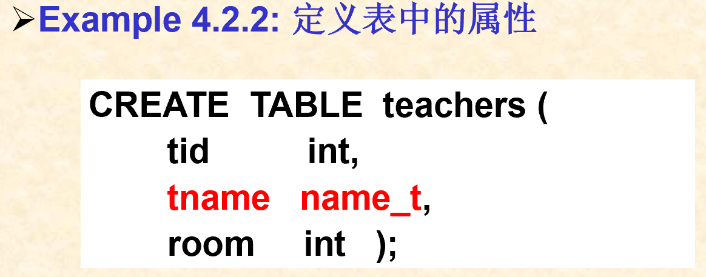

3. 用对象数据类型来直接创建一张表:增加完整性约束、表的结构和对象类型结构相同

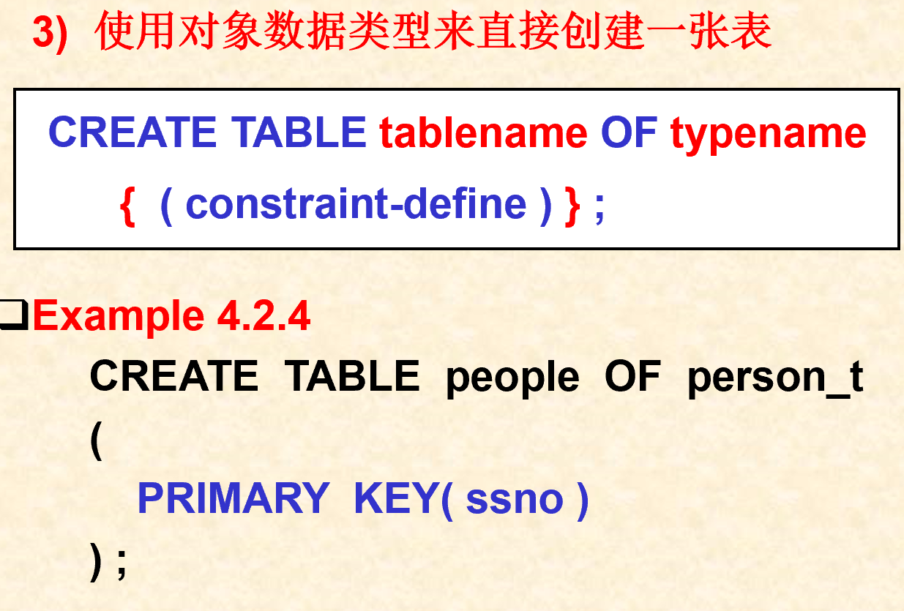

## 1.3. 对象值的创建、查询与更新

### 1.3.1. 对象值的创建
1. 对象构造函数:`typename ( argument, ...)`
2. 新建含有对象类型的表的值:`Insert into teachers  values (1234, name_t(‘Einstein’, ‘Albert’, ‘E’), 120);`

### 1.3.2. 对象的查询
1. 查找对象取值的函数:`value(...)`，value只能用来检索一个表的当前行，而不能用于构造一个新的对象。
2. 查找含有对象类型的值:`Select t.tid, t.tname, fname, t.tname.lname from table`

### 1.3.3. 对象值的更新
1. 修改整个对象值:
   1. 如果表的有一个属性的值域是对象类型，可以用对象进行赋值:`update people p set p.pname = name_t('Gould', 'Ben', null) where  ssno = 321341223;`
   2. 如果一张表是对象类型创建的，那么可以用对象值直接修改整个元组:`update people p set p = person_t (332341223, name_t('Gould', 'Glen', 'A'), 55) where ssno = 321341223;`
2. 修改对象中成员属性的值:`update people p set p.pname = name_t('Gould', 'Ben', null) where ssno = 321341223;`

## 1.4. 对象的引用类型(`REF <object type>`)
1. 对象的引用类型:
   1. 是指向某个元组对象的指针类型
   2. 可以用于实现对象类型之间的嵌套引用
2. 在使用含有REF类型的对象类型来创建关系表时，必须使用Scope for子句来限制REF属性的取值范围。

### 1.4.1. 对象类型之间的引用关系
1. 先定义一个对象类型X(基本对象类型)
2. 再定一个对象类型Y(引用类型)，类型Y中含有一个对X的引用属性(REF)

### 1.4.2. 创建含有引用类型的关系表
1. 先使用基本对象类型创建相应的基本关系表
```sql
create table customers of customer_t
      (primary key (cid));
```
2. 再使用含有REF属性的引用类型创建对应的关系表，这里的ordcust也被叫做外码，是指向一个具有相同cid的customers行对象的REF
```sql
create table orders of order_t  (
  primary key (ordno),
  scope for (ordcust) is customers,
  scope for (ordagent) is agents,    
  scope for (ordprod) is products
);
```

3. 完整创建顺序

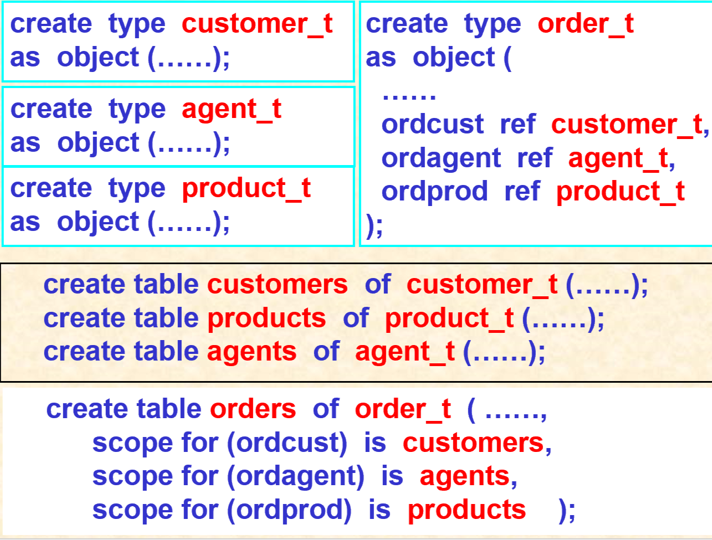

### 1.4.3. 引用关系查询
```sql
select o.ordno, o.ordcust.cname
  from orders o
  where o.dollars > 200.00
```

1. cid转化为ordcust来进行使用(等同于主键)

### 1.4.4. 函数与谓词
1. 两个函数:
   1. REF:获取对象(元组)的引用指针
   2. DEREF:返回引用指针所指向对象的值

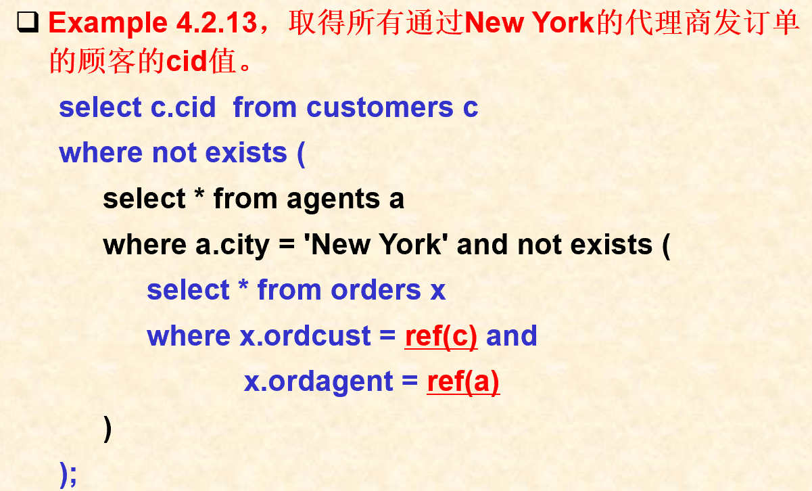
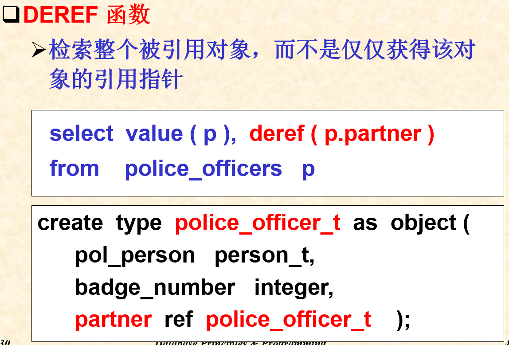

2. 两个谓词:
   1. IS DANGLING:用于判断所引用的元组对象是否存在，如果不存在，则为TRUE，如果存在，则为FALSE，主要用来检查错误对象引用指针。
   2. IS NULL:查找值为空(NULL)的REF属性

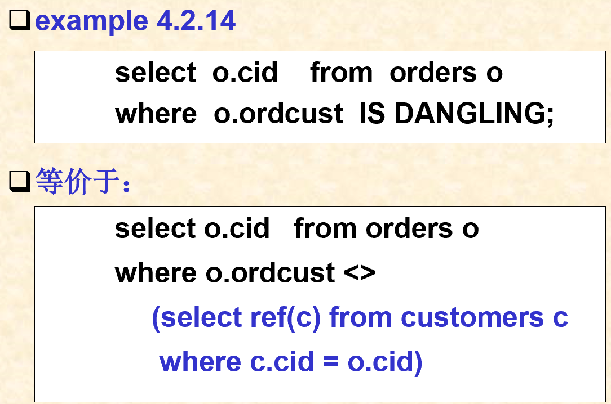

3. 对象引用指针的使用规则:
   1. A dangling REF is non-null but useless.
   2. If o.ordcust is null or dangling, then o.ordcust.cname is null.

### 1.4.5. 类型的循环嵌套定义
1. 对象类型不能嵌套定义(自己为自己的域的类型)
2. 对象引用可以嵌套引用(自己为自己的域的引用类型)
3. 同样也可以创建表，只需要嵌套.

### 1.4.6. 其他约束
1. 有关REF定义的其他约束(REF Dependencies)

#### 1.4.6.1. 两张表之间的相互REF关系的定义
1. 首先定义两个具有相互REF关系的对象类型
   1. 部分创建第一个对象类型(只有类型名，没有类型的详细定义)
   2. 详细定义第二个对象类型(包括引用第一个类型的引用属性)
   3. 再详细定义第一个对象类型
2. 再用创建好的对象类型创建关系表

#### 1.4.6.2. 两个具有相互REF关系的表/类型的删除
1. 在删除类型之前需要先删除表
2. 在删除类型时需要采用强制删除的方式:`DROP TYPE typename FORCE;`

#### 1.4.6.3. REF属性数据的加载
1. 方法一:先不管REF属性的赋值(赋值为NULL)，然后使用UPDATE操作修改REF上的值

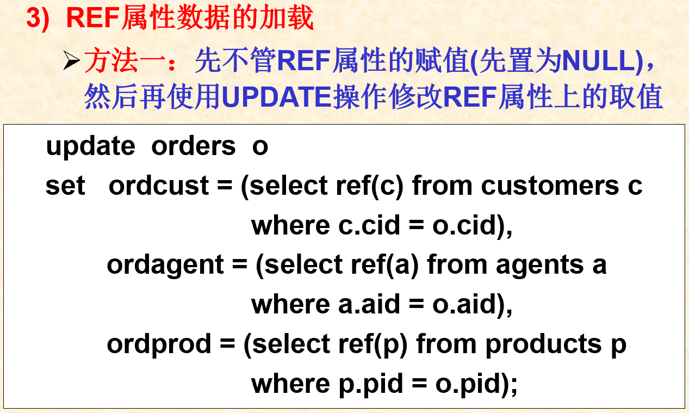

2. 方法二:使用带有子查询的插入操作

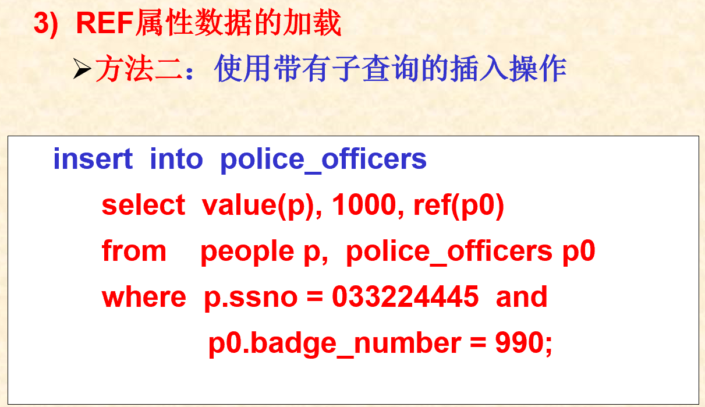

# 2. 集合类型(Collection Type)
1. 区分Oracle数据库中两种不同的集合类型:Nested Tables(Table Types) & Array Types

## 2.1. Table Types and Nested Tables(嵌套表)
1. 使用table type来定义表中的属性可以实现多值属性的功能
2. 创建一个新的表类型，使用dependents_t来定义表employees中的属性并形成一个嵌套表定义
```sql
create table employees (
  eid int,
  eperson person_t,
  dependents dependents_t,
  primary key (eid)
)nested table dependents store as dependents_t(这个是存储形式);
```
3. 每一个建表命令中都可以定义多个嵌套表，但一个table-type必须对应一个nested table


1. 嵌套表的访问:table(...)，访问其中的对象类型(转化成表的形式)

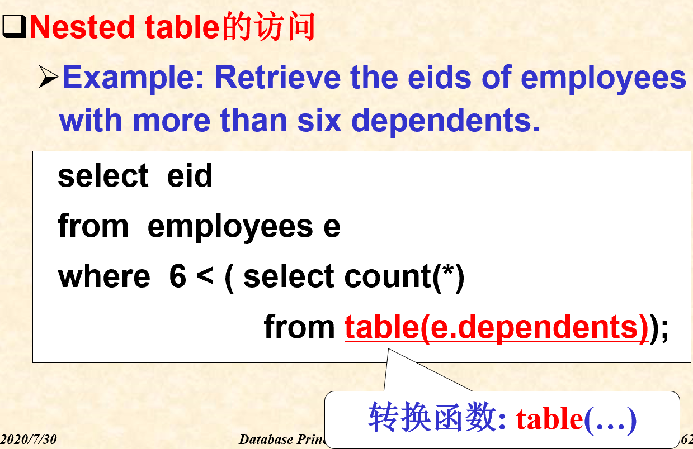

### 2.1.1. Oracle数据库注意
1. Oracle数据库没有提供nested table的相等比较运算
   - 可以使用 IN 操作符来实现某些需要通过 nested table 进行的查询功能

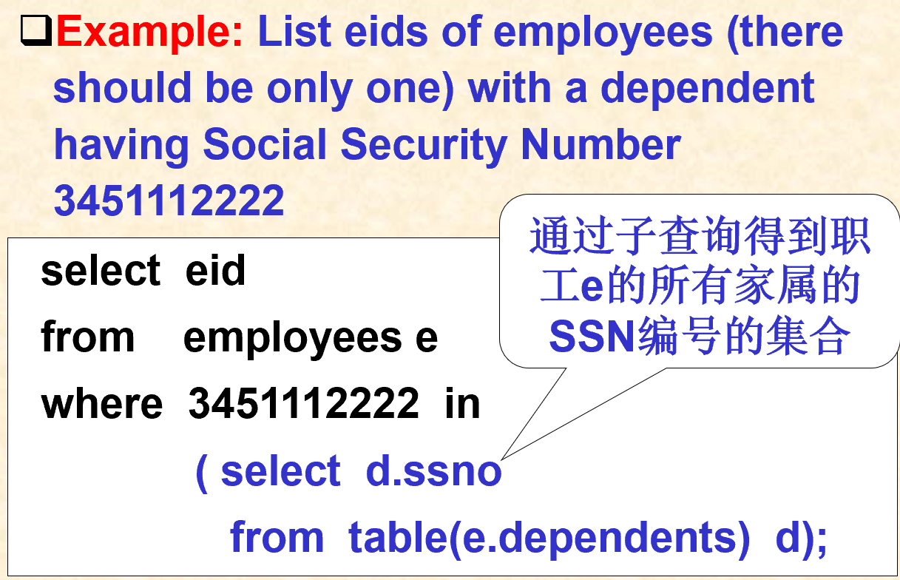

2. Oracle数据库提供了单个对象的相等比较功能
```sql
select eid from employees e
  where name_t("Lukas", "David", "E") in 
    (select d.pname from table(e.dependents) d);
```
3. Oracle不支持直接对嵌套表属性的统计查询功能，以下操作是错误的
```sql
select count(e.dependents)
  from employees e
    where e.eid = 101;
```
4. 可以使用表与自身的嵌套表的联接查询

```sql
select e.eid, d.ssno
  from employees e, table(e.dependents) d
```
5. 如果希望使用outer join来实现查询

```sql
select e.eid, d.ssno
  from employees e, table(e.dependents) (+) d
```

### 2.1.2. Nested Cursors(嵌套游标)
1. 可以使查询结果的显示更清楚
2. 其本质上是提示编译器，使用二重循环完成操作。

```sql
# 普通的查询操作
select e.eid, d.ssno as dep_sso
  from employees e, table(e.dependents) d
  where d.age < 16;
# 使用nested cursor的查询操作
select e.eid, 
  cursor ( select d.ssno as dep_ssno 
            from table(e.dependents) d
            where d.age < 16)  dep_tab
    from employees e;
```
7. 统计查询功能
  
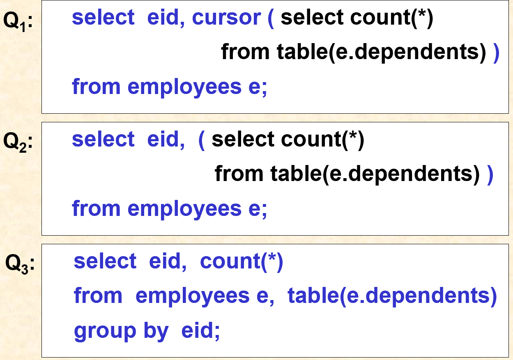

## 2.2. Array Types 数组类型
1. Array Types for VARRAYs

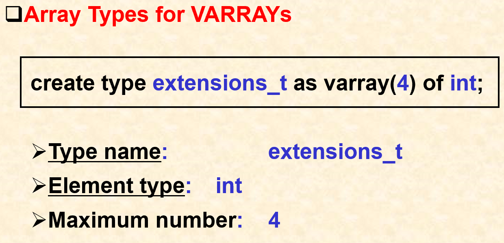

2. 使用Array Types定义表中的属性:一定要先创建类型为数组类型
```sql
create table phonebook  (
  person person_t,
  extensions extensions_t
);
```
3. 可以使用 table ( … ) 将一个VARRAY属性转换成一张嵌套表。
4. Nested table与VARRAY的比较
   1. 可以对嵌套表属性执行insert操作，或通过update操作修改其成员的取值
   2. 对VARRAY属性不能执行插入或修改，只能update修改VARRAY属性的取值

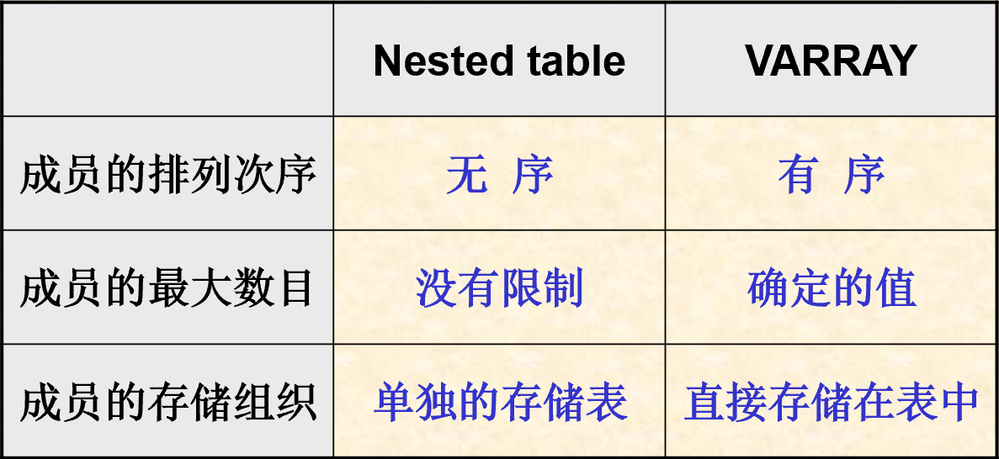

# 3. PL/SQL Procedures, UDFs, and Methods
1. Program block in PL/SQL
```sql
declare                    -- local variable
  i integer;
  total integer:= 0;
begin
  for i in 1..100 loop
    total := total + i;
  end loop;
  insert into result (rvalue) values (total);
end;
```

2. Create function in PL/SQL
```sql
create function sum_n(n integer) return integer is
  i integer; 
  total integer:= 0;  
begin
  for i in 1..n loop
    total := total + i;
  end loop;
  return total; -- return result to SQL or
  --  PL/SQL caller
end;
```

3. 创建对象类型point_t
```sql
create type point_t as object (  
  x int,  -- horizontal coordinate of the point
  y int   -- vertical coordinate of the point
);

```
4. 创建带有成员函数的对象类型(声明)rectangle_t

```sql
create type rectangle_t as object (
  pt1 point_t,  -- lower left-hand corner of rectangle
  pt2 point_t,  -- upper right-hand corner of rectangle
  member function inside(p point_t)
    return int, -- return 1 if point inside, else 0            
  member function area  -- method for area of rectangle 
    return int -- area value will always be an integer
);
```

5. 成员函数的实现
```sql
create type body rectangle_t as
  member function area return int is
  begin
      return (self.pt2.x-self.pt1.x) * (self.pt2.y-self.pt1.y);
  end;
end;
```

# 4. Extern Functions and Packaged User-Defined Types(UDTs)
1. Binary Data and BLOBs
   1. 二进制数据可以需要任意增长，直至所需的资源耗尽。
   2. BOLB的最大长度以字节为单位为4GB-1
2. External Functions
   1. 用其它的程序设计语言实现的可执行代码段，通过 Create Function 语句将其注册到数据库服务器中后，就可以如同调用使用PL/SQL定义的成员函数一样调用这些外部函数的功能
   2. 数据库管理系统无法直接处理BLOBs类型的值，但可以通过 外部函数来存取、处理 BLOBs 字段上的值。
3. Distinct Types
   1. 如果类型U是基于类型T的不同类型，则如果不进行强制转换，则无法比较这两种类型的对象。
   2. 区分类型的想法：提供类型检查的优点
   3. 特殊类型不经过转换不可以比较
4. Packaged UDTs and Other Encapsulated UDTs:课本182页(了解即可)
