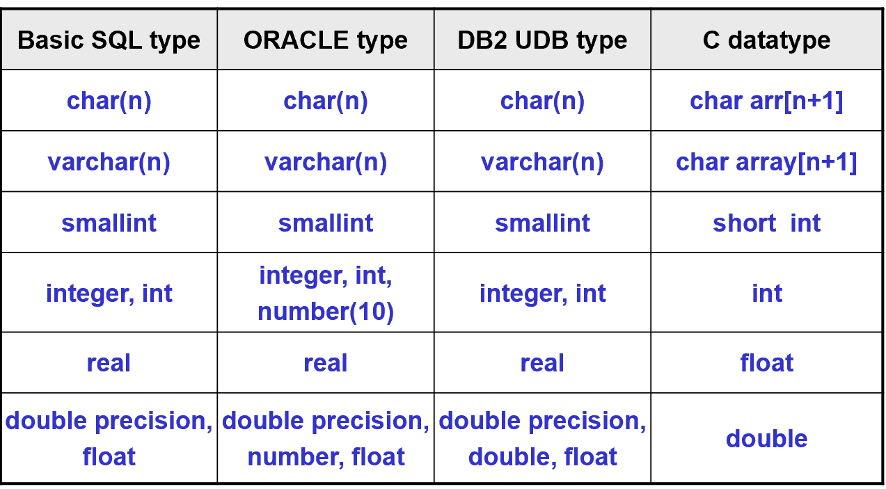
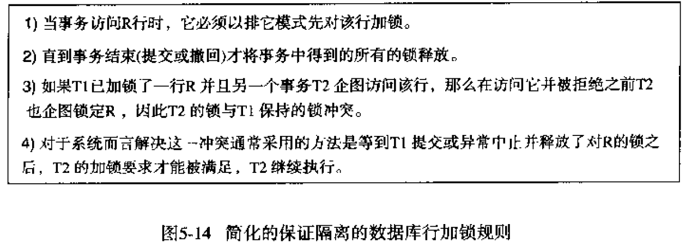
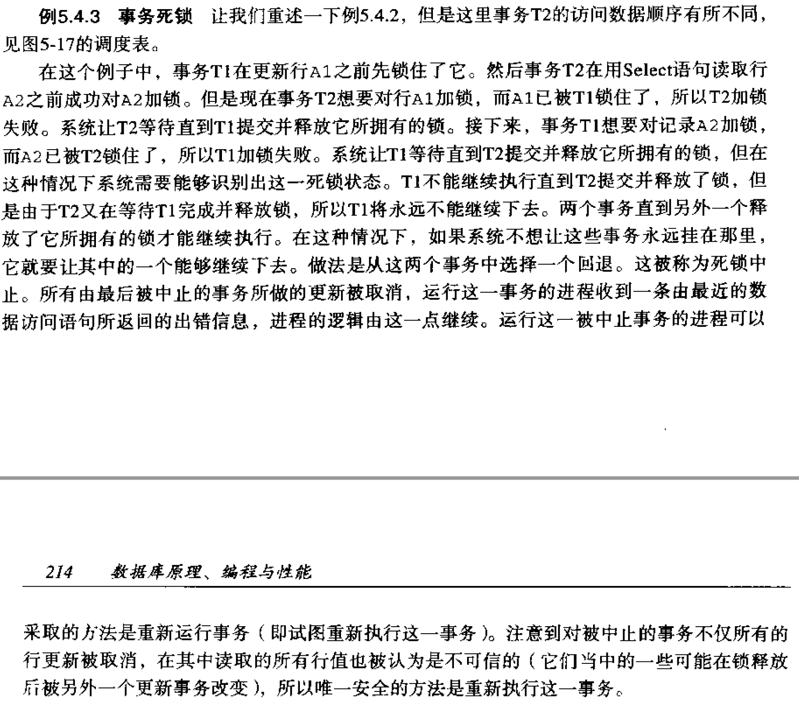
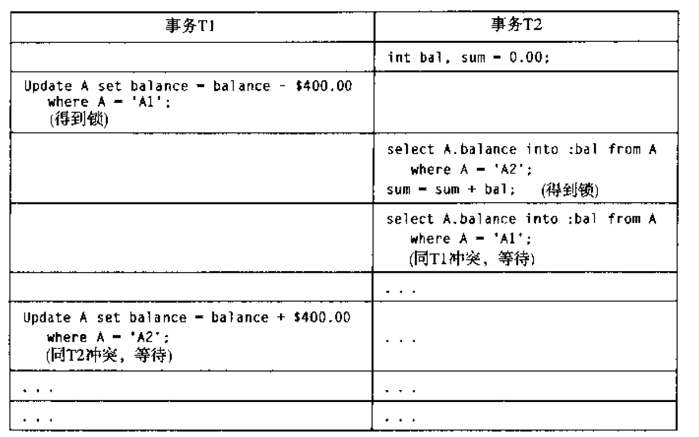
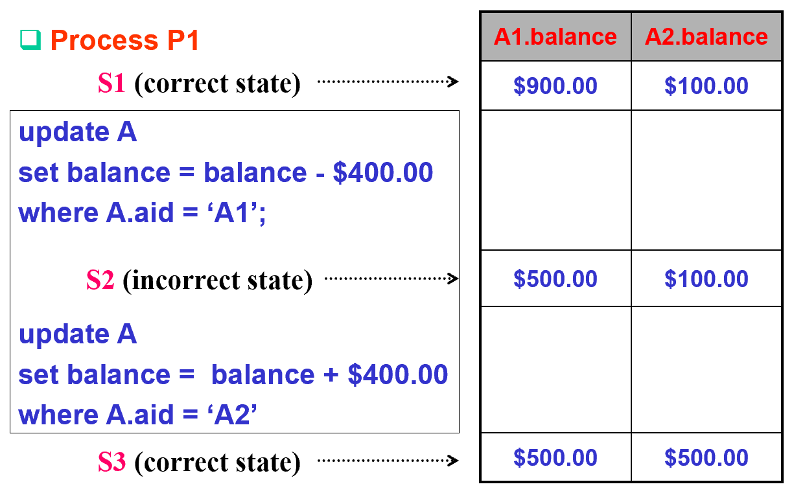
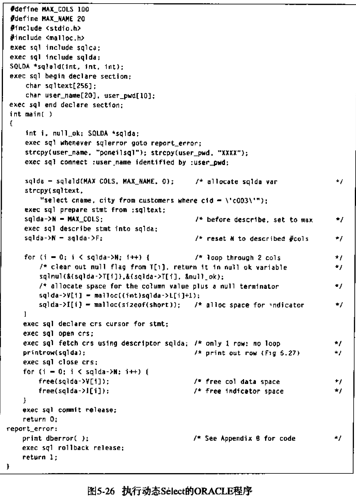
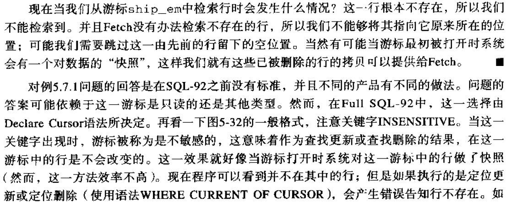

ch05-访问数据库的程序
---

<!-- TOC -->

- [1. 嵌入式SQL(ESQL， Embedded SQL)](#1-嵌入式sqlesql-embedded-sql)
  - [1.1. 为什么要引入ESQL?](#11-为什么要引入esql)
  - [1.2. C语言中的嵌入式SQL](#12-c语言中的嵌入式sql)
  - [1.3. ESQL和ISQL的语法不同](#13-esql和isql的语法不同)
  - [1.4. ESQL编程的步骤](#14-esql编程的步骤)
    - [1.4.1. 声明部分](#141-声明部分)
    - [1.4.2. 条件控制](#142-条件控制)
    - [1.4.3. 连接到数据库](#143-连接到数据库)
    - [1.4.4. 应用程序主体](#144-应用程序主体)
    - [1.4.5. 断开数据库](#145-断开数据库)
  - [1.5. ESQL和C的编程运行过程](#15-esql和c的编程运行过程)
  - [1.6. 使用游标进行复杂查询](#16-使用游标进行复杂查询)
    - [1.6.1. 声明游标](#161-声明游标)
    - [1.6.2. 开启游标](#162-开启游标)
    - [1.6.3. 游标拉取一行](#163-游标拉取一行)
    - [1.6.4. 关闭游标](#164-关闭游标)
  - [1.7. fetch结束后的异常操作](#17-fetch结束后的异常操作)
  - [1.8. Whenever语句](#18-whenever语句)
    - [1.8.1. CONDITION](#181-condition)
    - [1.8.2. ACTIONS 操作](#182-actions-操作)
  - [1.9. 数据类型](#19-数据类型)
  - [1.10. 事务编程](#110-事务编程)
    - [1.10.1. 事务内容](#1101-事务内容)
    - [1.10.2. 事务过程](#1102-事务过程)
    - [1.10.3. 事务例子](#1103-事务例子)
  - [1.11. 部分零散情况](#111-部分零散情况)
- [2. Dynamic SQL 动态SQL语句](#2-dynamic-sql-动态sql语句)
  - [2.1. 立即执行](#21-立即执行)
  - [2.2. 准备、执行和使用](#22-准备执行和使用)
  - [2.3. 动态选择](#23-动态选择)
  - [2.4. 前沿编程概念](#24-前沿编程概念)
    - [2.4.1. Scrollable Cursors 可滚动游标](#241-scrollable-cursors-可滚动游标)
    - [2.4.2. 游标敏感性](#242-游标敏感性)

<!-- /TOC -->

# 1. 嵌入式SQL(ESQL， Embedded SQL)
1. 嵌入式SQL是将SQL语句嵌入到Java、C等语言成分中去
2. 标准PPT38-40页
3. ESQL用来开发菜单应用

## 1.1. 为什么要引入ESQL?
1. 嵌入式SQL是将SQL嵌入到Java、C等语言成分中去。
2. 应用管理员和普通用户直接使用SQL的效率比较低。

## 1.2. C语言中的嵌入式SQL
```c
exec sql select count(*)
  into :host_var
  from customers;
```

1. 以`exec sql`开头，以`;`为结尾。
2. `into`子句,接受查询结果的宿主程序变量:`host variable(host_var)`

## 1.3. ESQL和ISQL的语法不同
1. `:`的前缀来保存到宿主变量
2. 宿主变量常常被用来存储数据库的操作的结果，或者是用来作为SQL查询语言的输入

## 1.4. ESQL编程的步骤

### 1.4.1. 声明部分
1. 声明需要使用到的宿主变量，必须预先声明
```c
float cust_discnt
int cust_discnt

exec sql begin declare section;
    char cust_id[5];
    char cust_name[14];
    float cust_discnt;
    char user_name[20], user_pwd[20];
exec sql end declare section;
```

### 1.4.2. 条件控制
1. 错误或者其他条件的时候需要执行的控制操作
```c
exec sql whenever sqlerror goto report_error;
exec sql whenever not found goto notfound;
```

2. 完成的程序实例
```c
exec sql whenever sqlerror goto handle_error ;
exec sql create table customers
	(cid char(4) not null, cname ...... ) ;

handle_error:
  exec sql whenever sqlerror continue ;
  exec sql drop table customers ;
  exec sql disconnect ;
  fprintf(stderr, "Couldn’t create customers table");
  return  –1;
```

3. 可以使用一个变量存储错误码，进行不同的异常处理
4. 从Oracle DB中获取到错误信息

```c++
#define ERRLEN 256	/* maximum length of error message */
int errlength = ERRLEN;	/* size of buffer */
int errsize;			/* to contain actual message length */
char errbuf[ERRLEN];	/* buffer to receive message */

sqlglm(errbuf, &errlength, &errsize);	/* get the error message for Oracle DB  */
printf("%.*s\n", errsize, errbuf);
```

### 1.4.3. 连接到数据库
1. SQL 99
```c
EXEC SQL CONNECT TO target-server
	[AS connect-name] [USER username];
EXEC SQL CONNECT TO DEFAULT;
```

- target-server:数据库名称
- connect-name:连接的Session名称
- username:用户名

2. Oracle
```c
EXEC SQL CONNECT TO :user_name
  IDENTIFIED BY :user_pwd ;
```

- user_name:Oracle用户名
- user_pwd:Oracle密码

### 1.4.4. 应用程序主体
1. 使用宿主语言进行交互
2. 通过ESQL进行交互
  1. prompt():期望得到一个标记(因为函数的第二个参数为1)，然后将它读到对应数组中(第3个参数)，数组可容纳4个字符(第4个参数)加上1个空字符结束符。

```c
while (prompt(cid_prompt, 1, cust_id, 4) >= 0)
{
	exec sql select cname, discnt
		into :cust_name, :cust_discnt
		from customers
		where cid = :cust_id;
  exec sql commit work;
    printf("CUSTOMER'S NAME IS  %s AND DISCNT IS  %5.1f\n", cust_name, cust_discnt);
    continue;                                 
notfound:
	printf("Can't find customer %s, continuing\n", cust_id);
}
```

3. 注意在关闭连接之前务必要提交或回滚事物
```c
EXEC SQL COMMIT WORK ;

EXEC SQL ROLLBACK WORK ;
```

4. Indicator Variables(指示符变量)
  1. `0`：一个数据库值，非空，赋值给host variable
  2. `>0`：截断的数据库字符串已分配给主机变量
  3. `=-1`：数据库的值为空，宿主变量是一个没有意义的值

```c
cd_ind = -1;
exec sql update customers
  set discnt = :cust_discnt INDICATOR :cd_ind
  where cid = :cust_id;
```

### 1.4.5. 断开数据库
1. SQL99
```c
EXEC SQL DISCONNECT connect-name ;
//或
EXEC SQL DISCONNECT CURRENT ;
```

2. Oracle:
```c
exec sql commit release;
//或
exec sql rollback release;
```

## 1.5. ESQL和C的编程运行过程
1. PreCompiler
2. C-Compiler
3. Executable Code

## 1.6. 使用游标进行复杂查询
1. One-Row-at-a-Time Principle：一次只有一行原则

### 1.6.1. 声明游标
1. 游标声明语法

```c
EXEC SQL DECLARE cursor-name CURSOR FOR
	subquery
	[ ORDER BY ...... ]
	[ FOR { READ ONLY |
		   UPDATE [ OF columnname, ...... ] } ]  ;
```

2. 声明游标例子：
```c
EXEC SQL DECLARE agent_dollars(cursor name) CURSOR FOR
  select aid, sum(dollars)
  from orders
  where cid = :cust_id
  group by aid ;
```

### 1.6.2. 开启游标
```c
EXEC SQL OPEN agent_dollars;
```
1. 一定要在之前声明游标，之后游标会放置到了结果集合的第一行。

### 1.6.3. 游标拉取一行
```c
while (TRUE) {	/* loop to fetch rows */
  exec sql fetch agent_dollars
            into :agent_id, :dollar_sum;
  printf("%s %11.2f\n",agent_id,dollar_sum);
}/* end fetch loop */
```

1. 操作:首先要向下滚动一行，然后将本行的数据传递到变量中

### 1.6.4. 关闭游标
```c
EXEC SQL CLOSE agent_dollars;
```

1. 操作:关闭游标，释放DBMS的结果集
2. 关闭之后就可以再次打开

## 1.7. fetch结束后的异常操作
```c
exec sql whenever not found goto finish;
while (TRUE) {
  exec sql fetch ... into ...;
}

finish: exec sql close agent_dollars;
```

## 1.8. Whenever语句
```c
EXEC SQL WHENEVER condition action;
```
1. 逻辑上类似:`if( condition ) { action }`
2. 只有当遇到一条后续的Whenever语句覆盖了前面的Whenever语句时，才可以改变程序的动作。(在程序的不同的论域)
```c
EXEC SQL WHENEVER sqlerror stop;
EXEC SQL WHENEVER sqlerror continue;//覆盖上一条
```
3. 价值:
   1. 一个条件陷阱能够大大减少处理错误返回的代码行数。
   2. 可以保证下不同数据库系统之间进行最大限度地移植。

### 1.8.1. CONDITION
1. SQLERROR:当出现编程错误时，可以终止程序运行
2. NOT FOUND:
   1. Select、Fetch、Insert、Update或者Delete子句没有行被影响到。
   2. 经常被用在结束循环、修改控制流的时候
3. SQLWARNING
   1. 非错误但值得注意的情况，不会影响程序的执行
   2. 他需要:`EXEC SQL INCLUDE sqlca;`

### 1.8.2. ACTIONS 操作
1. CONTINUE:不执行任何操作，程序按照正常流程继续
2. GOTO [tag]:对应的条件用Whenever语句覆盖
3. STOP:停止执行或程序、回滚当前事务、断开数据库连接
4. DO function | BREAK | CONTINUE:使用c语言调用，从此函数返回后，控制流从引发条件的ESQL语句之后的语句继续。

## 1.9. 数据类型


## 1.10. 事务编程
1. 事务的概念:将几个SQL语句组合成一个不可分割的，全有或全无的事务包。
2. 事务的保证和加锁:详细的在第10章完成讲解



3. 事务死锁:




### 1.10.1. 事务内容
1. 操作过程中会出现数据的不一致视图(比如没有到账)



### 1.10.2. 事务过程
1. 开始事务:在需要开始事务的时候开始事务
2. 结束事务:成功结束事务，提交事务;失败停止，开始回滚，并且暂时不可见。

### 1.10.3. 事务例子
```c++
#include <stdio.h>
#include "prompt.h"
int main(){
  // 变量声明
  exec sql begin declare section;
    char acctfrom[11], acctto[11];
    double dollars;
  exec sql end declare section;
  char dollarstr[20];
  //连接到默认数据库
  exec sql connect to default;
  //设置事务管理级别
  exec sql set transaction isolation level serializable;
  //开始循环处理
  while (1) {
    ......
    exec sql whenever sqlerror goto do_rollback;
    exec sql update accounts set balance = balance - :dollars where acct = :acctfrom;
    exec sql update accounts set balance = balance + :dollars where acct = :acctto;
    exec sql commit work;
    printf("Transfer complete.\n");
    continue;
    
  do_rollback:
    exec sql rollback work;
    printf("Trans failed.\n");
  }
  exec sql disconnect current;
  return 0;
}
```

## 1.11. 部分零散情况
1. 空值
   1. 字符空值:`\0`
   2. 数字空值:0
2. 空格为终止符。

# 2. Dynamic SQL 动态SQL语句
1. 允许我们在主机变量中构造一个字符串以用作SQL语句。

## 2.1. 立即执行
1. 立即执行:`EXECUTE IMMEDIATE :host_var;`

## 2.2. 准备、执行和使用
1. 准备、执行和使用:`PREPARE handle FROM :stmt_string;`,`EXECUTE handle USING :host_var;`

```c++
#include <stdio.h>
exec sql include sqlca;
exec sql begin declare section;
  char cust_id[5], sqltext[256];
exec sql end declare section;
int main()
{
  strcpy(sqltext, "delete from customers where cid = ?");
  exec sql whenever sqlerror goto report_error;
  exec sql connect to testdb;
  exec sql prepare delcust from :sqltext;
  while (1) {
    /* input customer’s id to cust_id */
    exec sql execute delcust using :cust_id;
    exec sql commit work;
  }
  ......
}
```

## 2.3. 动态选择
1. 动态选择:The Describe Statement and the SQLDA



## 2.4. 前沿编程概念

### 2.4.1. Scrollable Cursors 可滚动游标
```c++
//指针循环
EXEC SQL DECLARE cursor_name
  [ INSENSITIVE ]  [ SCROLL ]
  CURSOR  [ WITH  HOLD ]  FOR
    subquery  { UNION  subquery }
    [ ORDER  BY ...... ]
  [ FOR  READ  ONLY  |
    FOR  UPDATE  OF  columnname ...... ];
//执行指针
EXEC SQL FETCH
      [ { NEXT | PRIOR | FIRST | LAST |
      { ABSOLUTE | RELATIVE } value_spec } FROM ]
      cursor_name INTO ......;
```

1. 和正常游标不同的是:可以随意滚动，而不需要关闭再次打开游标
2. 正常游标只能从前到后，不能回退，如果要回退需要关闭。
3. 支持绝对行(ABSOLUTE)

### 2.4.2. 游标敏感性
1. 游标的打开可能会影响到锁的问题，但是这种隔离可能在并发条件下产生副作用。
2. INSENSITIVE关键字表示这个游标式不敏感的，打开的时候已经对当前列完成了快照



