ch07-完整性、视图、安全和目录
---

<!-- TOC -->

- [1. 完整性约束](#1-完整性约束)
  - [1.1. Create Table命令的使用方法](#11-create-table命令的使用方法)
  - [1.2. 列完整性约束](#12-列完整性约束)
  - [1.3. 列完整性约束的例子](#13-列完整性约束的例子)
  - [1.4. 外键(Foreign key)](#14-外键foreign-key)
  - [1.5. 参照完整性](#15-参照完整性)
  - [1.6. 表的列和约束的修改](#16-表的列和约束的修改)
  - [1.7. 数据库触发器(Database Trigger)](#17-数据库触发器database-trigger)
    - [1.7.1. 数据库触发器的定义](#171-数据库触发器的定义)
    - [1.7.2. Update触发器类型](#172-update触发器类型)
    - [1.7.3. 触发器例子](#173-触发器例子)
- [2. 视图(View)](#2-视图view)
  - [2.1. 视图的定义](#21-视图的定义)
  - [2.2. 视图的声明](#22-视图的声明)
  - [2.3. 嵌套视图定义](#23-嵌套视图定义)
  - [2.4. 视图的特权](#24-视图的特权)
  - [2.5. 视图的查询过程](#25-视图的查询过程)
  - [2.6. 删除视图](#26-删除视图)
  - [2.7. 可更新视图条件](#27-可更新视图条件)
  - [2.8. 视图的值](#28-视图的值)
- [3. 安全性](#3-安全性)
  - [3.1. GRANT子句](#31-grant子句)
  - [3.2. REVOKE语句](#32-revoke语句)
- [4. 系统目录和架构](#4-系统目录和架构)
- [5. 注](#5-注)

<!-- /TOC -->

# 1. 完整性约束
1. Create Table的同时创建完整性约束
2. 完整性约束
   1. 列约束
   2. 行约束:Primary, not null
3. 参照完整性：外键
4. 触发器
5. 其他修改方式
   1. 修改表:`ALTER TABLE`
   2. 删除表:`DROP TABLE`

## 1.1. Create Table命令的使用方法
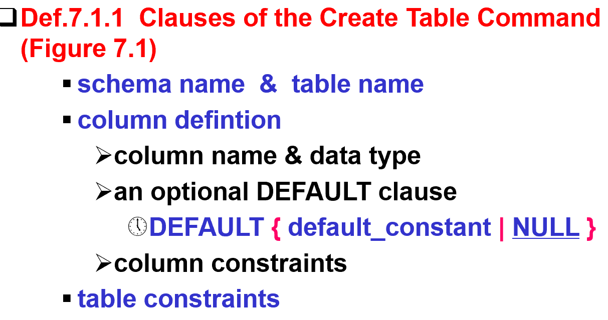

## 1.2. 列完整性约束
1. 单列完整性约束
   1. NOT NULL 或 DEFAULT NULL
   2. 约束名(可选)
   3. UNIQUE 且 NOT NULL：候选键
   4. PRIMARY KEY
   5. REFERENCES
      1. FOREIGN KEY
         1. 表 T1 中列的集合 F 被定义为 T1 的外键当且仅当 F 中任意一行的值结合起来，都是 NULL 或是另一个表 T2 的候选键或主键
      2. RESTRICT
      3. CASCADE
      4. SET NULL
   6.  CHECK

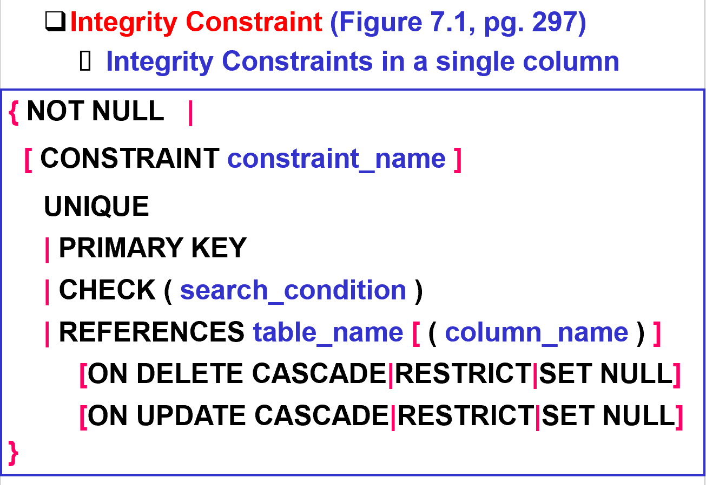

2. 多列完整性约束

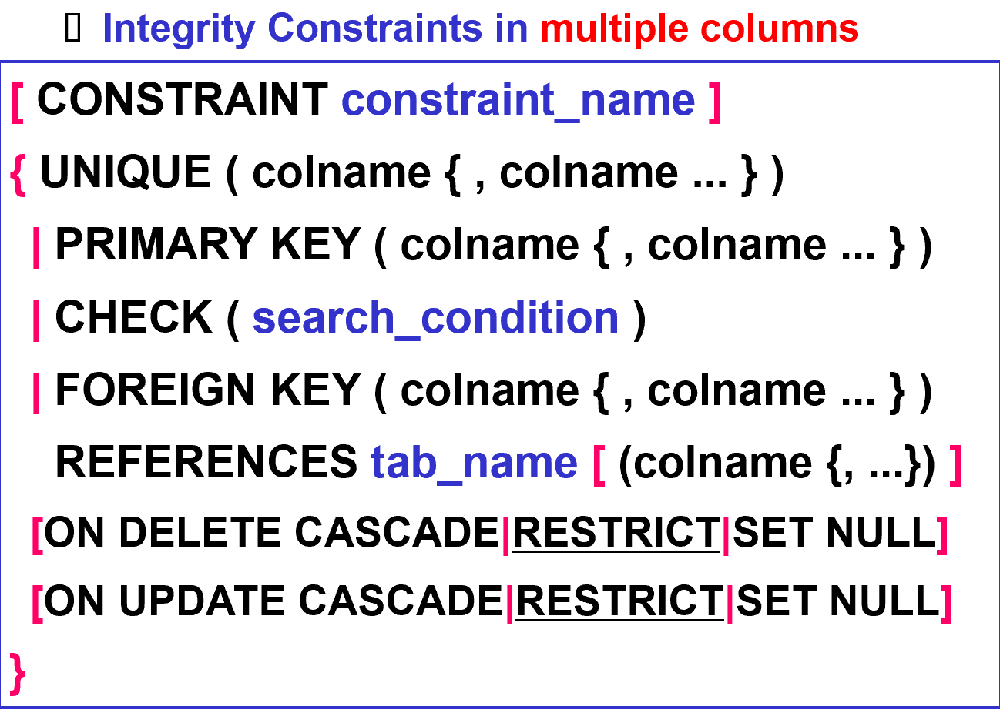

3. 候选键约束:UNIQUE & NOT NULL
4. constraint是声明约束
   1. constraint <约束名> <约束内容>

## 1.3. 列完整性约束的例子
1. 正常的值约束

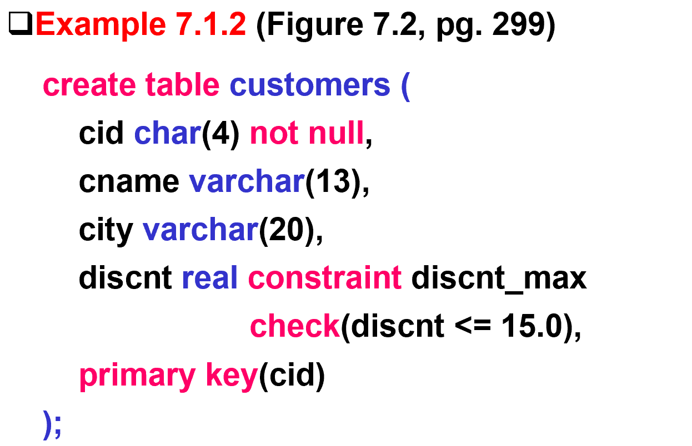

2. 外键约束

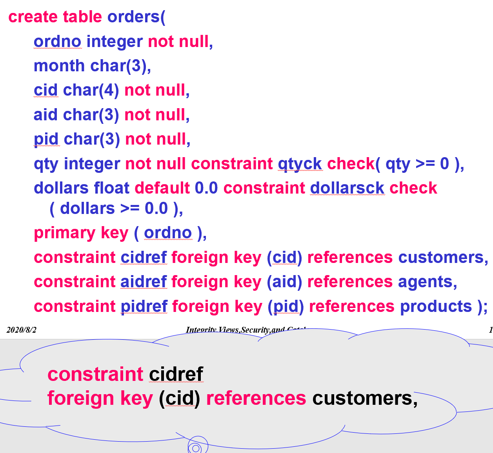

## 1.4. 外键(Foreign key)
1. 如果要求任一行中F的值的组合至少包含一个空值，或者匹配一组P的值组合，则将表T1中的一组F列定义为T1的外键 表示参考表T2的候选或主键。

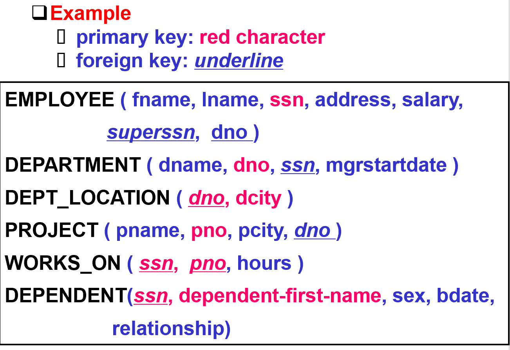

2. 外键的正确性保证
  
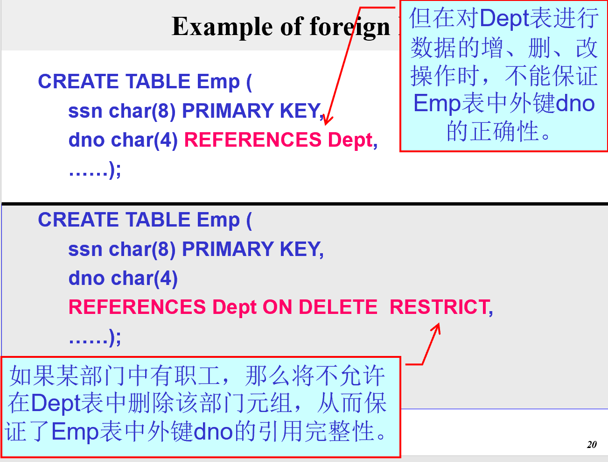
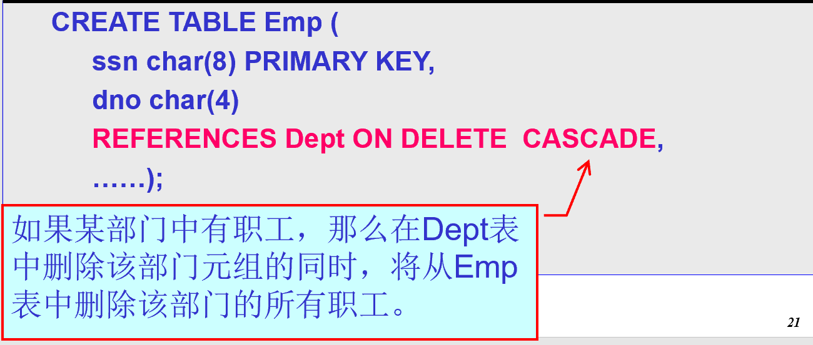
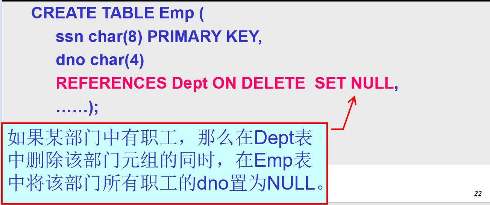

## 1.5. 参照完整性
1. T1的任何行中的F列必须满足下列条件之一：
   1. 在至少一个允许空值的列中具有空值
   2. 没有空值并且等于T2的某些行上P的值组合。

## 1.6. 表的列和约束的修改
1. 表的列:Add、Drop、Modify
2. 约束:Add、Drop

## 1.7. 数据库触发器(Database Trigger)
1. 数据库触发器是响应于数据库中特定表或视图上的某些事件而自动执行的过程代码。
2. 触发器主要用于维护数据库上信息的完整性。 例如，将新记录(新工人)添加到雇员表时，还应该在税金，休假和薪水表中创建新记录。
3. 触发器分为行级触发器和列级触发器
   1. For Each Row:结果集的每一行被影响了就执行一次
   2. For Each Statement:对于整个结果集只触发一次

### 1.7.1. 数据库触发器的定义
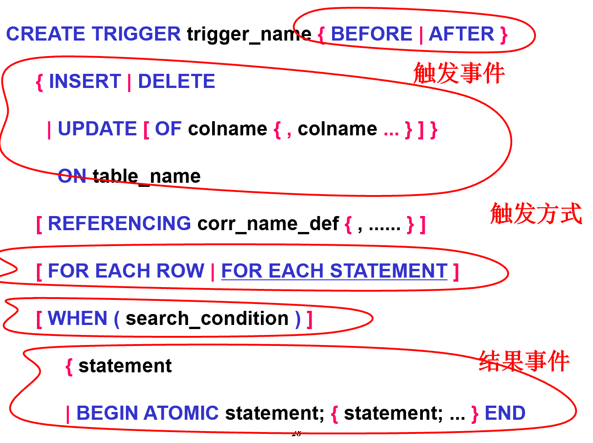
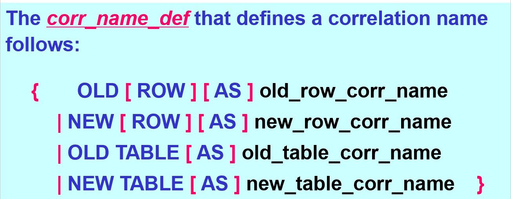

### 1.7.2. Update触发器类型
1. 行级别触发器:在行的任何列值更改之前或之后执行
2. 列级别触发器:在指定列更改之前或之后执行此操作

### 1.7.3. 触发器例子
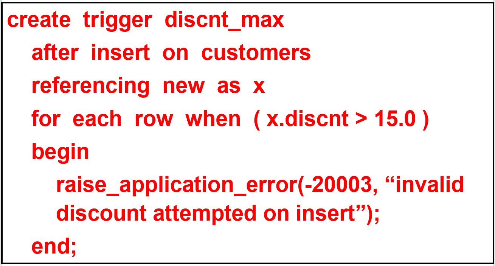
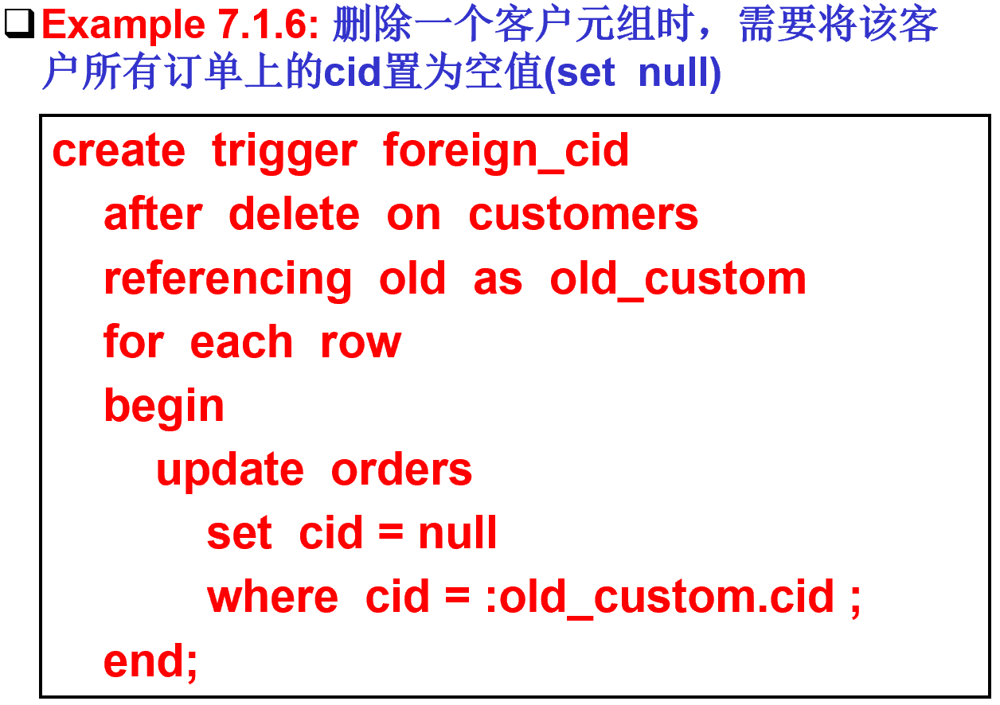

# 2. 视图(View)
1. Create View：在执行Create View的语句时，没有数据被检索或存储，但是视图对象作为一个对象被存放在系统目录中。
2. 视图不是数据快照，只是存储了一些定义。
3. 任何SQL SELECT语句检索的数据均为表形式。
4. 我们想在其他Select语句的FROM子句中使用此TABLE。

## 2.1. 视图的定义
1. 它是一个由子查询产生的表，但具有自己的名称(表名称或属性名)
2. 它可以在大多数情况下用作由SQL CREATE TABLE语句创建的基表
3. 属性:
   1. 本身没有数据存储，只是从中选择数据的窗口(只是SELECT选取出来的数据
   2. 因此，它被视为虚拟表
4. 不足:视图的更新受限

## 2.2. 视图的声明
```sql
CREATE VIEW view_name [(col_name {, …...})]
  AS  subquery
  [ WITH CHECK OPTION ]
```
1. 视图内容:
   1. 可以省略名字列表，如果子查询的目标列表(选择子句)具有不需要限定符的列名。
   2. 需要为表达式或不明确的姓氏提供名称。
   3. 可以以任何方式重命名列。
2. 子查询:
   1. **不可以使用Order By子句**
3. 有检查选项
   1. 如果发生以下情况，将不允许更新或通过可更新的视图插入:它们导致视图子查询看不到的行。

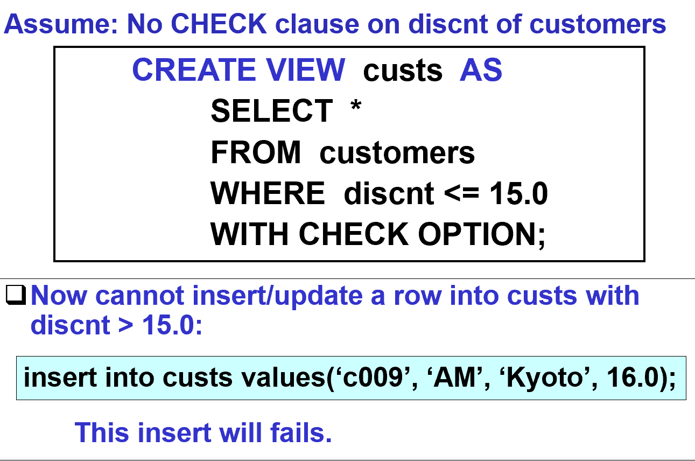

4. 视图的创建的执行:
   1. 视图定义在系统目录中被存储为数据库中特定的物体
   2. 没有数据被拉取或存储(类似引用)
5. 查询修改
   1. 可以修改访问视图的查询或更新语句。
   2. 以便修改后的查询或更新实际上对基表执行访问。
6. 注意：声明的话，如果有重名的列则必须声明对应列的内容

## 2.3. 嵌套视图定义
1. 在视图的基础上再次定义视图

## 2.4. 视图的特权
1. 创建视图的用户是用户的所有者
2. 所有者被赋予视图更新权限
   1. 视图是可更新的
   2. 用户在定义视图的基表上具有所需的更新特权。

## 2.5. 视图的查询过程
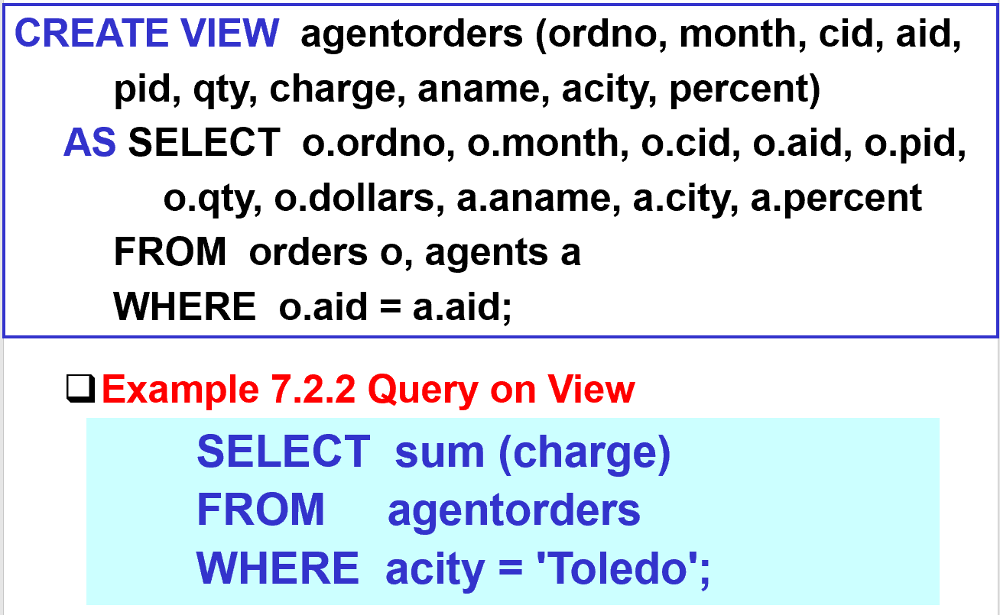
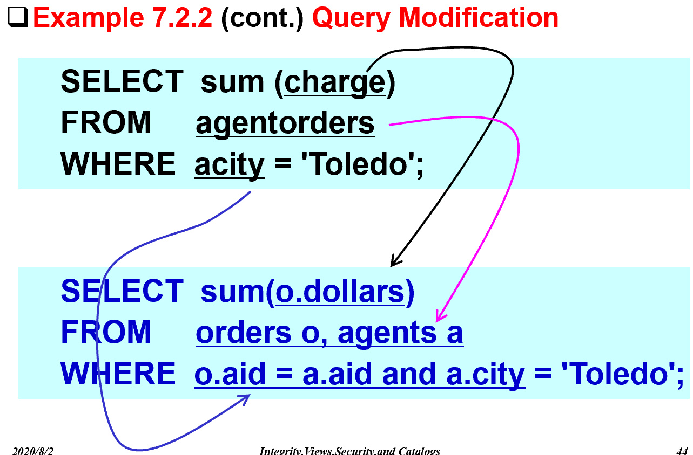

## 2.6. 删除视图
```sql
DROP { TABLE table_name | VIEW view_name }
  { CASCADE | RESTRICT };
```
1. 视图被删除的时候，没有行会被影响到

## 2.7. 可更新视图条件
1. 子查询的FROM子句必须仅包含一个表，并且如果该表是视图表，则它也必须是可更新的视图表。
2. GROUP BY和HAVING子句均不存在。
3. 未指定DISTINCT关键字。
4. WHERE子句不包含直接或通过视图间接引用FROM子句中任何表的子查询。
5. 子查询的所有结果列都是简单的列名：没有表达式，没有列名出现多次。
6. 注:Oracle数据库的更新加入视图必须满足:(PPT 54 - 57)
   1. 是多对一的加入视图
   2. 视图的各列在N侧包含表的主键


## 2.8. 视图的值
1. 视图提供了一种使复杂的，通常发出的查询更易于编写的方法。
2. 视图允许过时的表以及引用它们的程序在重组中幸免，程序数据独立性
3. 视图增加了安全方面，以允许不同的用户以不同的方式查看相同的数据。

# 3. 安全性
1. GRANT & REVOKE statements

## 3.1. GRANT子句
```sql
GRANT {ALL PRIVILEGES|privilege {, privilege … }}
  ON [ TABLE ] tablename | viewname
  TO { PUBLIC | user-name { , user-name … } }
  [ WITH GRANT OPTION ]
```
1. 可以被表的所有者使用
   1. 表所有者具有这个表的全部权限
   2. 其他用户不可以访问表如果他们没有这个表上的任何一个权限
2. 列权限在视图上也会具有
3. 权限:
   1. SELECT、DELETE、INSERT
   2. UPDATE [col_name, {,col_name ...}]
   3. REFERENCE [col_name, {, col_name ...}]
4. PUBLIC:全部
5. WITH GRANT OPTION
6. 注:在视图上有的权限，不需要在原表上有

## 3.2. REVOKE语句
```sql
REVOKE { ALL PRIVILEGES 
    | privilege {, privilege …} }
  ON  tablename | viewname
  FROM { PUBLIC | user-name {, user-name … }}
  { CASCADE | RESTRICT }
```
1. 撤销先前授予用户的特权。

# 4. 系统目录和架构
1. 数据字典
   1. SQL命令行创建的所有对象都会被作为表的对象存储在系统中
2. 数据库管理员访问其他站点，会通过查看系统目录(元数据)来查看表是否存在，表中有什么列

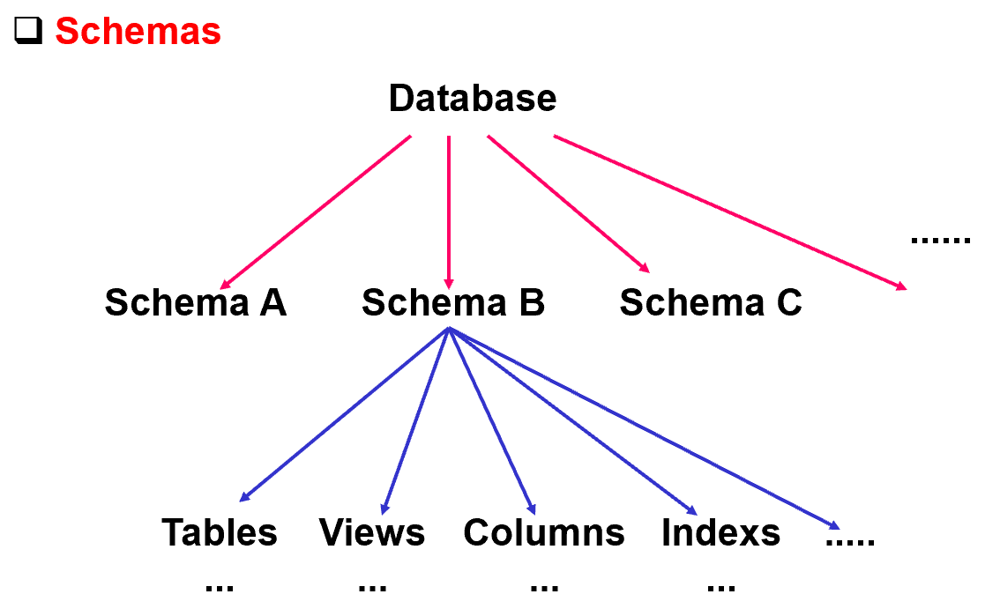

# 5. 注
1. 修改视图可以影响表，修改表也会影响视图
